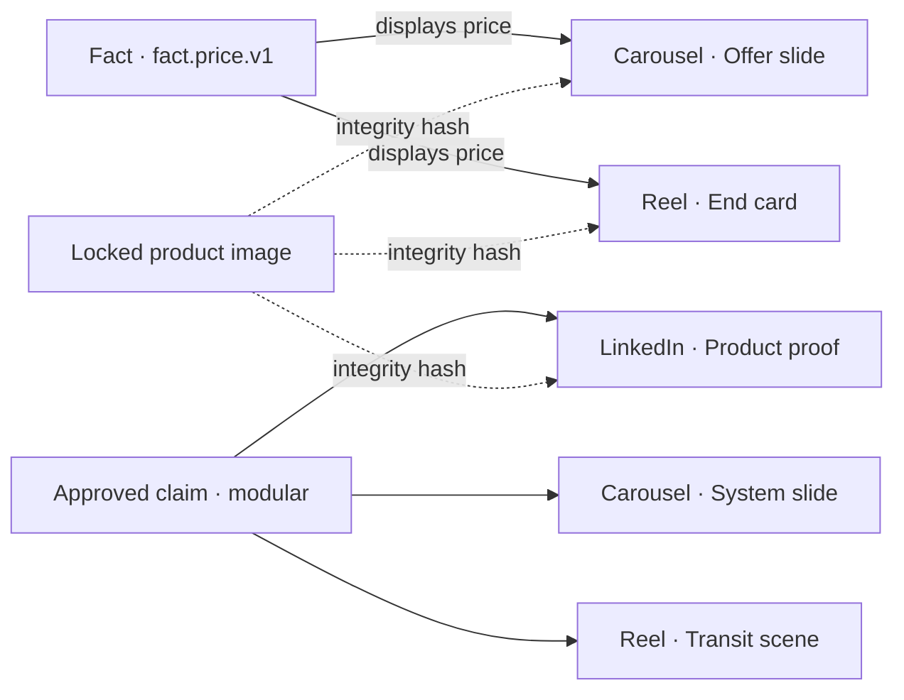
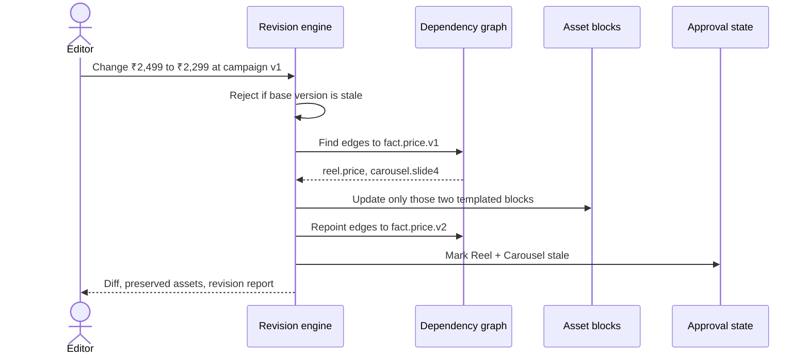

# RECAST architecture

## Product contract

RECAST separates **campaign meaning** from **rendered creative**. Facts and claims are versioned source records. Asset blocks depend on them through explicit edges. A revision is a graph operation with an audit trail, not a global find-and-replace.

LinkedIn has no price edge, so a price revision cannot change its blocks or approval.

## Revision flow

## Data model

All structures are declared as Zod schemas in `lib/models.ts`, then inferred as TypeScript types:

- `Campaign`: aggregate root, version and status.
- `Fact`: versioned value with approved, superseded, removed, or prohibited state.
- `Claim`: approved/prohibited wording plus evidence.
- `BrandRule`: tone, colour, typography, CTA, or launch date.
- `CreativeConcept`: promise, metaphor, hook, and content plan.
- `Asset`: a channel output with a distinct storytelling role.
- `AssetBlock`: smallest selectively editable unit; may carry a template, removal fallback, text limit, lock, or integrity hash.
- `DependencyEdge`: explicit relation from one fact version to one asset block, with a human-readable reason.
- `Revision`: immutable change record with before/after copy, affected and preserved assets, reviewer state, and Markdown report.
- `ValidationResult`: evidence-bearing readiness check.
- `Approval`: per-output reviewer state.

The seed campaign is parsed by `CampaignSchema` before it reaches the UI. Export runs through the same schema.

## Selective update rules

1. Verify `baseCampaignVersion` equals the current campaign version.
2. Resolve the current approved fact by its stable logical key.
3. Find dependency edges pointing to that exact fact version.
4. Create a new immutable fact version.
5. Update only connected blocks using their deterministic templates or removal fallback.
6. Repoint or remove the relevant dependency edges.
7. Preserve unconnected asset objects unchanged.
8. Mark approvals stale only for assets containing changed blocks.
9. Record affected assets, preserved assets, block diffs, reasons, timestamps, and reviewer state.

## Claim safety

The deterministic guard compares requested wording with the controlled claim registry. Prohibited wording produces an `UnsupportedClaimError` with an approved replacement. The default UI does not expose an override, so unsupported wording cannot silently enter campaign output.

## Validation design

- **Price consistency:** every price edge resolves to a block containing the latest approved price.
- **Approved claims:** every dependency points to a current approved fact.
- **Asset integrity:** every locked block hash equals the seeded approved baseline.
- **Layout fit:** copy length stays within its template’s deterministic character limit.
- **Revision status:** changed outputs remain stale until human approval.
- **Tone and aesthetic quality:** explicitly marked for human judgment.

## Local-first reliability

Zustand holds the in-browser demo session. Builder work is scoped to `sessionStorage`, and campaign approval state remains in memory. No network service is required for generation, revisions, checks, approvals, or exports. A future provider may suggest structured concept or copy data, but those responses must pass the same Zod schemas before entering the graph.

## Runtime trust boundaries

- **Public edge:** the Cloudflare Worker serves the Vinext app. RECAST removes the unused image-transform route, applies CSP and anti-framing headers, and uses different cache lifetimes for hashed bundles and unversioned media.
- **Browser workspace:** user-entered briefs and comments are local to the active browser tab. They are presentation state, not authoritative approvals or server records.
- **Campaign engine:** only schema-valid campaign structures enter the deterministic revision engine. Base-version checks stop stale jobs, and explicit dependency edges define exactly what can change.
- **External research:** source links are static citations opened by the user. The server does not crawl or proxy them.
- **Future identity:** `chatgpt-auth.ts` is an optional trusted-proxy helper and is not an active authorization boundary in the public demo.

## Operational baseline

`/api/health` exposes non-sensitive service mode and engine readiness with `Cache-Control: no-store`. Route errors fall into a recoverable, accessible UI state. GitHub Actions enforces lint, typecheck, unit tests, production build, and the Playwright judge flow. See `PRODUCTION_READINESS.md` for the remaining multi-tenant gates.
