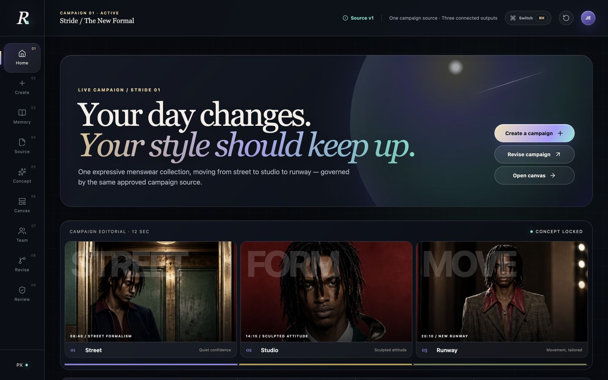
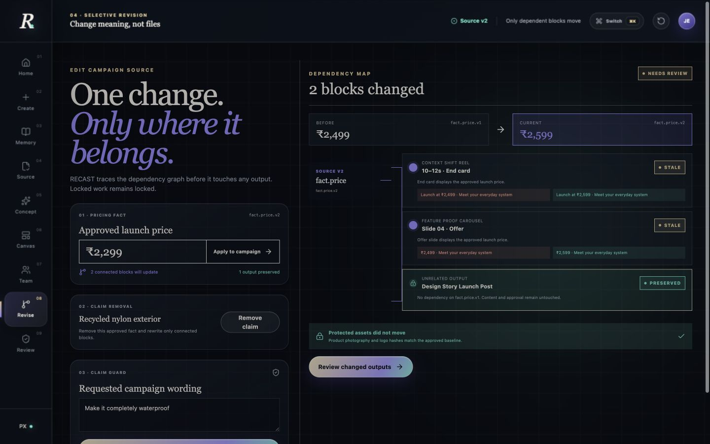
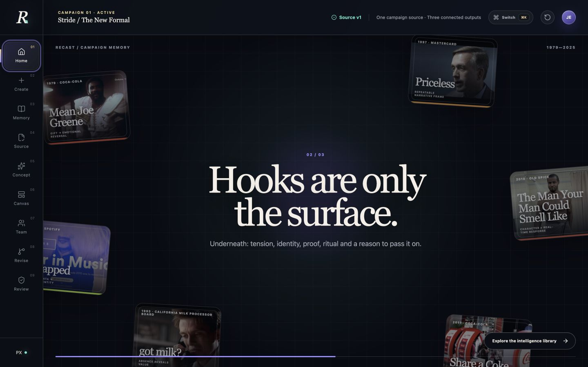
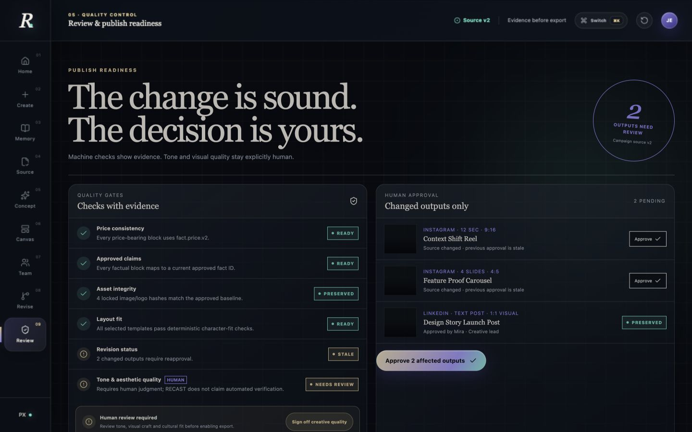
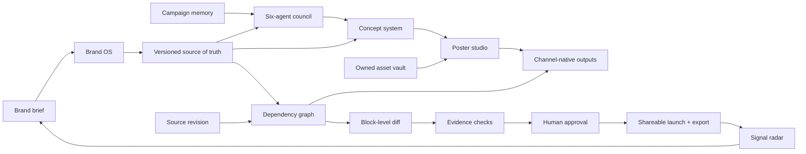

<p align="center">
  
</p>

<p align="center">
  
</p>

<p align="center"><strong>AI BUILD CHALLENGE 2026 · TRACK 02 · TEAM PARADOX</strong></p>

<h1 align="center">RECAST</h1>

<p align="center">
  <strong>A governed AI campaign operating system—from brand truth to a live launch.</strong><br />
  Brand OS. Agent council. Asset vault. Poster production. Selective revision. Hosting. Signal learning.
</p>

<p align="center">
  <a href="https://recast-ai-studio.vercel.app/"><strong>Explore the live experience ↗</strong></a>
  &nbsp;·&nbsp;
  <a href="./ARCHITECTURE.md">Architecture</a>
</p>

<p align="center">
  <a href="https://github.com/JagadeeshwaranCEO/RECAST/actions/workflows/ci.yml"></a>
  
  
  
  
</p>

---

## The idea

Most content tools generate isolated assets. A price changes, a claim is withdrawn, or legal wording moves—and teams hunt through every caption, carousel, reel and approval thread by hand.

**RECAST models a campaign as a dependency graph.** Every factual content block points back to an approved source. When that source changes, RECAST identifies exactly what must move, preserves everything that should not, invalidates only affected approvals and leaves a reviewable audit trail.

<p align="center">
  
</p>

```text
CHANGE THE SOURCE         TRACE THE MEANING         REVIEW THE DIFFERENCE
₹2,499 → ₹2,599    →     2 dependent blocks   →   2 stale · 1 preserved
```

## The moment that makes RECAST different

<p align="center">
  
</p>

Change the approved launch price once. RECAST updates the Reel end card and Carousel offer slide, preserves the unrelated LinkedIn story, protects locked imagery, and marks only the changed outputs for reapproval.

| Ordinary generator | RECAST |
|---|---|
| Regenerates an asset | Traces meaning across the campaign |
| Makes broad text replacements | Updates referenced content blocks only |
| Hides what changed | Shows before/after evidence |
| Treats every output independently | Maintains one versioned campaign source |
| Assumes generated means approved | Keeps creative judgment explicitly human |

## Campaign intelligence, not inspiration theatre

RECAST studies enduring campaign mechanics—emotional reversal, absence, ritual, identity, participation, character and proof—and makes those patterns explorable without copying historical creative.

<p align="center">
  
</p>

The memory library is a researched strategy layer. It is intentionally described as retrieval and pattern intelligence—not as model training. Sources and creative rights remain attributable.

The product expansion also studies the workflow standards behind sixteen design, AI, brand-management, social and listening products. The source-by-source mapping and rights boundary are documented in [docs/PRODUCT_RESEARCH.md](./docs/PRODUCT_RESEARCH.md).

## Evidence before export

<p align="center">
  
</p>

Machine checks verify price consistency, approved claims, locked-asset integrity, deterministic text fit and revision state. Tone, visual quality and cultural fit stay with a human reviewer.

## What works today

- Multi-brand Campaign Builder for brand voice, audience, objective, proof, market, channels and visual tokens.
- Brand OS with palette presets, typography behavior, locked production rules and live poster-token sync.
- Six-agent campaign council for research, strategy, copy, art direction, claims and activation; organizer-listed OpenRouter, Gemini, Groq and NVIDIA NIM adapters with a deterministic fallback.
- Publish-ready channel packs with finished Instagram copy, LinkedIn posts, X threads, short-form video scripts, CTAs, hashtags, production notes, copy actions and one cohesive Markdown export.
- Rights-aware Asset Vault for owned product imagery, campaign posters, logos and references.
- Editable Poster Studio with 1:1, 4:5, 9:16 and 1.91:1 layouts plus real PNG export at production dimensions.
- Launch Control with six enforced release gates, including content safety, a working campaign microsite, launch timing, channel package queue and a portable share URL.
- Signal Radar demo for mentions, sentiment, claim risk and an insight-to-brief learning loop; external providers are clearly marked as unconnected.
- Complete seeded Stride campaign spanning Instagram Reel, Instagram Carousel and LinkedIn.
- Versioned source of truth for prices, claims, evidence, prohibited wording and brand rules.
- Explicit dependency-graph revision engine—no broad string replacement.
- Claim guard that rejects unsupported “completely waterproof” wording and offers an approved alternative.
- Selective stale-approval invalidation for changed outputs only.
- Per-output approval, approve-all, revision history and deterministic demo reset.
- Exportable campaign JSON, revision Markdown, LinkedIn copy and a labelled reel scene-plan preview.
- Responsive, keyboard-accessible interface with loading, empty, warning, success and review states.
- A focused seven-stage judge path; Brand OS, assets, research, collaboration and monitoring remain available through the searchable tool switcher.
- Session-scoped drafts, owner-scoped Supabase persistence, distributed model quota, security headers, bounded public payloads, health check and error boundary.
- Vercel Analytics, Speed Insights, privacy-minimised agent events and request IDs for a production monitoring baseline.
- Public Vercel production deployment plus Supabase-backed private workspaces and public-safe campaign publication records, protected by row-level security.
- Automated unit, browser, type, lint and production-build gates.

## How the system thinks



The deterministic control plane is the product guarantee: facts, claims and approvals behave predictably even when a future model-assisted suggestion layer is unavailable. See [ARCHITECTURE.md](./ARCHITECTURE.md) for the data contracts and trust boundaries.

## Run it locally

**Requirements:** Node.js 22 LTS

```bash
git clone https://github.com/JagadeeshwaranCEO/RECAST.git
cd RECAST
npm install
npm run dev
```

Open [http://localhost:3001](http://localhost:3001).

## The three-minute judge path

```text
Campaign home
  → Brief
  → Agent council + finished channel pack
  → Poster studio
  → Revise
  → Change price
  → Inspect the dependency diff
  → Test an unsupported waterproof claim
  → Use the approved replacement
  → Review only affected outputs
  → Human sign-off
  → Publish and open the shareable campaign
```

## Verify the build

```bash
npm run test:unit
npm run test:e2e
npm run lint
npm run typecheck
npm run audit:deps
npm run build
```

Or run the entire CI contract:

```bash
npm run ci
```

Playwright may require a one-time browser install:

```bash
npx playwright install chromium
```

## Technology

| Layer | Choice |
|---|---|
| Interface | React 19, Next.js 16, TypeScript 5.9 |
| State | Zustand with session-scoped persistence |
| Validation | Zod schemas at every campaign boundary |
| AI | Server-side provider fabric for OpenRouter, Gemini, Groq, NVIDIA NIM and OpenAI; structured-output validation and deterministic fallback |
| Hosting | Vercel production deployment with a Next.js 16 build |
| Persistence | Supabase Postgres, passwordless Auth and owner-scoped Row Level Security |
| Local runtime | Native Next.js development server on port 3001 |
| Testing | Vitest and Playwright |
| Quality | ESLint, TypeScript, production build and GitHub Actions |

## Repository map

```text
app/
  CampaignStudio.tsx       Product experience and interaction shell
  studio/                   Brand OS, agents, assets, poster, launch and radar
  api/agents/               Rate-limited, schema-validated agent adapter
  c/[slug]/                 Shareable campaign microsite
  api/health/              Operational health endpoint
  globals.css              Editorial design system and responsive layout
lib/
  models.ts                Zod schemas and inferred TypeScript models
  seed.ts                  Validated Stride demo campaign
  revision-engine.ts       Dependency traversal and selective updates
  campaign-intelligence.ts Strategy-pattern research layer
  agent-orchestrator.ts     Six-agent contracts and deterministic council
  ai-provider.ts            Secure multi-provider routing and output validation
store/
  workspace-store.ts       Local campaign workspace state
  production-store.ts      Assets, poster and launch workspace state
tests/
  revision-engine.test.ts  Semantic reliability tests
  agent-orchestrator.test.ts Agent governance tests
  e2e/recast.spec.ts       Full judge-path browser test
docs/images/               Repository presentation assets
```

## Honest boundaries

This hackathon build remains fully usable without an API key. The agent council can use the free/API-key resources supplied by the organizers—OpenRouter, Gemini, Groq or NVIDIA NIM—while OpenAI remains supported. Keys stay on the server, every provider response is validated against the same campaign schema, and any timeout, provider error or malformed response falls back to the deterministic governed planner.

Set `RECAST_AI_PROVIDER=auto` and configure any one of `OPENROUTER_API_KEY`, `GEMINI_API_KEY`, `GROQ_API_KEY`, `NVIDIA_API_KEY` or `OPENAI_API_KEY`. The default OpenRouter model is the free-model router; provider quotas and terms can change, so confirm them before the final demo. See `.env.example` for model overrides.

- Multi-user tenancy, role management and cloud asset uploads remain future deployment gates.
- RECAST Cloud is provisioned with owner-scoped Supabase tables. Before sending production magic links, add `https://recast-ai-studio.vercel.app` to Supabase Auth’s Site URL and Redirect URLs; configure a branded SMTP provider before sending at scale.
- Reel export is a labelled scene-plan preview; a video renderer is not configured.
- Commercial deployments require rights-cleared client photography.
- Uploaded files remain browser-session assets in this prototype. Share links carry the approved text campaign payload and use deployment assets; production requires object storage, malware scanning, rights metadata and a durable database.
- Social publishing and monitoring connectors are presented as explicit connection points—not as working third-party integrations—until OAuth or API credentials are configured.
- Tone and aesthetic quality remain human-review decisions by design.
- Model output can propose structured strategy and copy, but cannot bypass source validation or human approval.

Read [PRODUCTION_READINESS.md](./PRODUCTION_READINESS.md) and [docs/SECURITY_AND_SCALE.md](./docs/SECURITY_AND_SCALE.md) for the verified security review, recent advisory coverage, monitoring contract and exact path from hackathon system to multi-tenant SaaS.

---

<p align="center">
  <strong>RECAST</strong><br />
  Change meaning. Preserve the work.<br /><br />
  Built by <strong>Team PARADOX</strong> for AI Build Challenge 2026 · Track 02<br />
  AI Content Studio for Brands &amp; Creators
</p>
