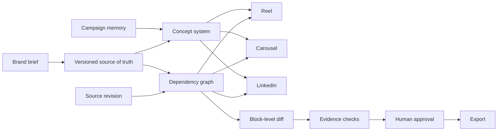

<p align="center">
  
</p>

<p align="center">
  
</p>

<p align="center"><strong>AI BUILD CHALLENGE 2026 · TRACK 02 · TEAM PARADOX</strong></p>

<h1 align="center">RECAST</h1>

<p align="center">
  <strong>A meaning-aware campaign studio that changes the fact—not every file.</strong><br />
  One approved source. Connected outputs. Selective revision. Evidence before export.
</p>

<p align="center">
  <a href="https://recast-campaign-studio.kavitha1975-vlr.chatgpt.site/"><strong>Explore the live experience ↗</strong></a>
  &nbsp;·&nbsp;
  <a href="./DEMO_SCRIPT.md">3-minute judge demo</a>
  &nbsp;·&nbsp;
  <a href="./ARCHITECTURE.md">Architecture</a>
</p>

<p align="center">
  <a href="https://github.com/JagadeeshwaranCEO/RECAST/actions/workflows/ci.yml"></a>
  
  
  
  
</p>

---

## The idea

Most content tools generate isolated assets. A price changes, a claim is withdrawn, or legal wording moves—and teams hunt through every caption, carousel, reel and approval thread by hand.

**RECAST models a campaign as a dependency graph.** Every factual content block points back to an approved source. When that source changes, RECAST identifies exactly what must move, preserves everything that should not, invalidates only affected approvals and leaves a reviewable audit trail.

<p align="center">
  
</p>

```text
CHANGE THE SOURCE         TRACE THE MEANING         REVIEW THE DIFFERENCE
₹2,499 → ₹2,599    →     2 dependent blocks   →   2 stale · 1 preserved
```

## The moment that makes RECAST different

<p align="center">
  
</p>

Change the approved launch price once. RECAST updates the Reel end card and Carousel offer slide, preserves the unrelated LinkedIn story, protects locked imagery, and marks only the changed outputs for reapproval.

| Ordinary generator | RECAST |
|---|---|
| Regenerates an asset | Traces meaning across the campaign |
| Makes broad text replacements | Updates referenced content blocks only |
| Hides what changed | Shows before/after evidence |
| Treats every output independently | Maintains one versioned campaign source |
| Assumes generated means approved | Keeps creative judgment explicitly human |

## Campaign intelligence, not inspiration theatre

RECAST studies enduring campaign mechanics—emotional reversal, absence, ritual, identity, participation, character and proof—and makes those patterns explorable without copying historical creative.

<p align="center">
  
</p>

The memory library is a researched strategy layer. It is intentionally described as retrieval and pattern intelligence—not as model training. Sources and creative rights remain attributable.

## Evidence before export

<p align="center">
  
</p>

Machine checks verify price consistency, approved claims, locked-asset integrity, deterministic text fit and revision state. Tone, visual quality and cultural fit stay with a human reviewer.

## What works today

- Complete seeded Stride campaign spanning Instagram Reel, Instagram Carousel and LinkedIn.
- Versioned source of truth for prices, claims, evidence, prohibited wording and brand rules.
- Explicit dependency-graph revision engine—no broad string replacement.
- Claim guard that rejects unsupported “completely waterproof” wording and offers an approved alternative.
- Selective stale-approval invalidation for changed outputs only.
- Per-output approval, approve-all, revision history and deterministic demo reset.
- Exportable campaign JSON, revision Markdown, LinkedIn copy and a labelled reel scene-plan preview.
- Responsive, keyboard-accessible interface with loading, empty, warning, success and review states.
- Session-scoped workspace persistence, security headers, safe caching, health check and error boundary.
- Automated unit, browser, type, lint and production-build gates.

## How the system thinks



The deterministic control plane is the product guarantee: facts, claims and approvals behave predictably even when a future model-assisted suggestion layer is unavailable. See [ARCHITECTURE.md](./ARCHITECTURE.md) for the data contracts and trust boundaries.

## Run it locally

**Requirements:** Node.js 22.13+

```bash
git clone https://github.com/JagadeeshwaranCEO/RECAST.git
cd RECAST
npm install
npm run dev
```

Open [http://localhost:3000](http://localhost:3000).

## The three-minute judge path

```text
Campaign home
  → Revise
  → Change price
  → Inspect the dependency diff
  → Test an unsupported waterproof claim
  → Use the approved replacement
  → Review only affected outputs
  → Approve and export
```

The complete timed narration is in [DEMO_SCRIPT.md](./DEMO_SCRIPT.md).

## Verify the build

```bash
npm run test:unit
npm run test:e2e
npm run lint
npm run typecheck
npm run build
```

Or run the entire CI contract:

```bash
npm run ci
```

Playwright may require a one-time browser install:

```bash
npx playwright install chromium
```

## Technology

| Layer | Choice |
|---|---|
| Interface | React 19, Next.js 16, TypeScript 5.9 |
| State | Zustand with session-scoped persistence |
| Validation | Zod schemas at every campaign boundary |
| Runtime | Vinext, Vite and Cloudflare Workers tooling |
| Testing | Vitest and Playwright |
| Quality | ESLint, TypeScript, production build and GitHub Actions |

## Repository map

```text
app/
  CampaignStudio.tsx       Product experience and interaction shell
  api/health/              Operational health endpoint
  globals.css              Editorial design system and responsive layout
lib/
  models.ts                Zod schemas and inferred TypeScript models
  seed.ts                  Validated Stride demo campaign
  revision-engine.ts       Dependency traversal and selective updates
  campaign-intelligence.ts Strategy-pattern research layer
store/
  workspace-store.ts       Local campaign workspace state
tests/
  revision-engine.test.ts  Semantic reliability tests
  e2e/recast.spec.ts       Full judge-path browser test
docs/images/               Repository presentation assets
```

## Honest boundaries

This hackathon build is deterministic and requires no API key. It does not pretend that simulated generation is a production AI service.

- Persistent accounts, team tenancy and a production database are future deployment gates.
- Reel export is a labelled scene-plan preview; a video renderer is not configured.
- Commercial deployments require rights-cleared client photography.
- Tone and aesthetic quality remain human-review decisions by design.
- A future model adapter may propose structured copy, but cannot bypass campaign validation or approval.

Read [PRODUCTION_READINESS.md](./PRODUCTION_READINESS.md) for the security review and the exact path from hackathon system to multi-tenant SaaS.

---

<p align="center">
  <strong>RECAST</strong><br />
  Change meaning. Preserve the work.<br /><br />
  Built by <strong>Team PARADOX</strong> for AI Build Challenge 2026 · Track 02<br />
  AI Content Studio for Brands &amp; Creators
</p>
