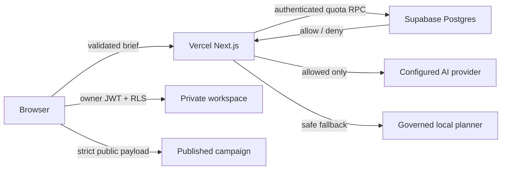

# Security, resilience, and scale plan

Last reviewed: 2026-10-01

## Deployed trust model

The browser may edit and preview a campaign without an account. A configured model is only called after Supabase verifies the user's JWT and atomically consumes one of eight per-minute requests. Anonymous, invalid-token, quota-service failure, provider failure, timeout, and malformed-model-output paths fall back to the deterministic planner without spending provider budget.

Private workspace writes and publication writes are owner-scoped with RLS. Anonymous database access can read only rows with `status = 'published'`. Public payloads are independently validated in the editor, reader, and Postgres constraint so a bypass at one layer does not silently become public content.

## Security review result

The repository and deployed production surface were reviewed on 2026-10-01. Three validated issues were fixed:

1. **Distributed AI cost abuse:** the old process-local limiter could reset across Vercel regions. Paid AI now requires authentication plus an atomic Postgres quota; the local limiter remains only as an inexpensive first filter.
2. **Clickjacking and missing browser policy:** production now sends CSP `frame-ancestors 'none'`, `X-Frame-Options: DENY`, `nosniff`, strict referrer/permissions policies, COOP, CORP, and related headers.
3. **Malformed public campaign payload:** URL, local storage, and Supabase payloads now share one strict bounded schema; invalid content renders a safe fallback instead of crashing the route.

The unused Cloudflare/Vinext/Drizzle development path was removed, React was patched to 19.2.8, Next.js to 16.3.8, and both full and production-only npm audits returned zero known advisories at review time.

## Ten recent framework vulnerabilities checked

| # | Advisory | RECAST exposure and action |
|---|---|---|
| 1 | CVE-2026-94483 — image-optimizer SSRF | Patched with Next 16.3.8; no remote image allow-list is configured. |
| 2 | CVE-2026-94543 — self-hosted SSG/ISR cache poisoning | Patched; production is on Vercel and RECAST does not use the Pages Router. |
| 3 | CVE-2026-94484 — catch-all SSG/ISR cache poisoning | Patched; RECAST has no root catch-all or ISR campaign route. |
| 4 | CVE-2026-94485 — metadata route disclosure | Patched; RECAST does not expose dynamic metadata image routes. |
| 5 | GHSA-h694-7cp9-m8p3 — nested `use cache` data leak | Patched; Cache Components are not enabled. |
| 6 | CVE-2026-94544 — Draft Mode cache leak | Patched; RECAST does not use Draft Mode or `use cache`. |
| 7 | CVE-2026-94486 — development MCP information disclosure | Patched; development binds locally and is never the production runtime. |
| 8 | GHSA-2xp9-vwfh-vxw4 — AVIF optimizer RCE | Patched by the current Next release; RECAST has no remote AVIF optimization surface. |
| 9 | CVE-2026-75604 — Windows-hosted unauthenticated RCE | Patched; Vercel production is not Windows-hosted. |
| 10 | CVE-2026-64641 — Server Action CPU denial of service | Patched; RECAST uses bounded Route Handler input and no Server Actions. |

The framework fixes are defense in depth; absence of an affected feature is not treated as a reason to remain on a vulnerable version.

## Capacity path

| Stage | Architecture | Gate before entering the stage |
|---|---|---|
| Hackathon / controlled beta | Stateless Vercel UI and API, CDN assets, Supabase Auth/Postgres, synchronous model request, eight model calls per user per minute | Current verified implementation |
| Public beta | Durable generation-job table, queue/worker, idempotency keys, per-tenant daily token/cost budgets, signed object uploads, malware scan, retry/dead-letter policy | Load test and provider-budget alerting |
| Growth | Separate operational events from campaign aggregates, pooled database connections, partition high-volume events, cache immutable public campaigns, webhook replay protection | Measured p95 latency, queue age, DB saturation, and restore drill |
| Enterprise | Organization roles, SSO/SCIM, regional data policy, KMS-managed connector tokens, immutable audit export, retention/legal-hold controls | External penetration test, privacy review, incident exercise, contractual SLO |

Scale is driven by measured bottlenecks. The deterministic planner keeps the core workflow available when a provider, quota service, or budget gate is unavailable; generation is the first workload moved behind a queue because it is slow, costly, and externally rate-limited.

## Monitoring and response

- Vercel Web Analytics and Speed Insights provide traffic and real-user performance signals.
- `/api/agents` emits privacy-minimised JSON events with request ID, outcome, status, duration, provider, and remaining quota; it never logs the brief, token, or provider key.
- `/api/health` provides a no-store, non-secret readiness signal.
- Supabase security/performance advisors are checked after schema changes; quota and RLS changes are migrations, not dashboard-only edits.
- CI blocks merges on lint, types, unit tests, build, and browser tests; dependency audit is explicit.

Initial service objectives for a public beta are 99.9% successful page delivery, p95 cached-page load under 2.5 seconds, p95 synchronous API completion under the configured provider timeout, and zero paid calls without an authenticated quota grant. Alerts should cover 5xx rate, p95 latency, local-fallback spikes, quota denials, database saturation, provider spend, and stale queue age.

Central log retention and alert routing depend on the selected Vercel plan and incident destination. Until those are configured, the repository must not claim a 24/7 on-call service.

### Accepted advisor notices

Supabase reports two deliberate notices on the quota ledger. `private.recast_agent_quotas` has RLS with no policies because `anon` and `authenticated` have no table privileges at all. `public.recast_consume_agent_quota()` is intentionally `SECURITY DEFINER` so an authenticated caller can perform only the atomic increment without receiving direct table access; it has no arguments, requires `auth.uid()`, uses an empty `search_path`, and is not executable by `anon`. Direct ACL verification is part of the release checklist. Unused-index notices are expected while the beta tables are empty and should be re-evaluated from production query statistics rather than removed pre-emptively.

## Safe penetration-test envelope

Automated verification covers malformed and oversized request bodies, anonymous model-cost bypass attempts, schema-confusion payloads, public-route crash regression, security headers, RLS advisors, dependency advisories, and normal product flows. Destructive denial-of-service, credential stuffing, third-party provider attacks, and access to data not owned by the tester are out of scope for routine CI and require written authorization in a dedicated staging environment.
